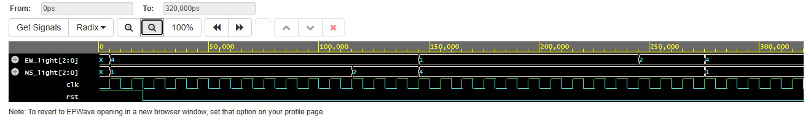

# Traffic Light Controller using Verilog HDL

## Overview

This project implements a 4-way Traffic Light Controller using Verilog HDL.

The controller uses a Moore Finite State Machine (FSM) to control traffic signals for two directions:

- North-South (NS)
- East-West (EW)

The traffic lights operate in a fixed sequence to ensure that both directions are controlled safely.

## Features

- Moore FSM-based design
- Four traffic control states
- Parameterized Green and Yellow timing
- Active-high reset
- Separate North-South and East-West light outputs
- RTL-based sequential and combinational logic
- Simulation and waveform verification using EDA Playground

## FSM State Sequence

The controller operates through four states:

| State | North-South | East-West |
|-------|-------------|-----------|
| State 0 | Green | Red |
| State 1 | Yellow | Red |
| State 2 | Red | Green |
| State 3 | Red | Yellow |

The sequence continuously repeats:

**NS Green → NS Yellow → EW Green → EW Yellow → NS Green**

## Timing

The design is parameterized using:

- `GREEN_TIME = 10` clock cycles
- `YELLOW_TIME = 3` clock cycles
- Clock period = 10 ns

The timing parameters can be modified according to the required application.

## Design

The controller consists of:

1. **State Register**  
   Stores the current FSM state.

2. **Timer / Counter**  
   Counts clock cycles and determines when the controller should move to the next state.

3. **Next-State Logic**  
   Determines state transitions based on the timer.

4. **Output Logic**  
   Generates the North-South and East-West traffic light signals based on the current state.

## Simulation

The design was simulated using **EDA Playground**.

The testbench:

- Generates a 100 MHz clock
- Applies an active-high reset
- Instantiates the traffic light controller
- Monitors North-South and East-West outputs
- Generates waveform data for verification

## Waveform

The simulated waveform demonstrates the expected sequence of traffic light transitions.



## Project Structure

```text
Traffic-Light-Controller-Verilog/
│
├── traffic_light_controller.v
├── traffic_light_controller_tb.v
├── traffic_light_waveform.jpeg
└── README.md
